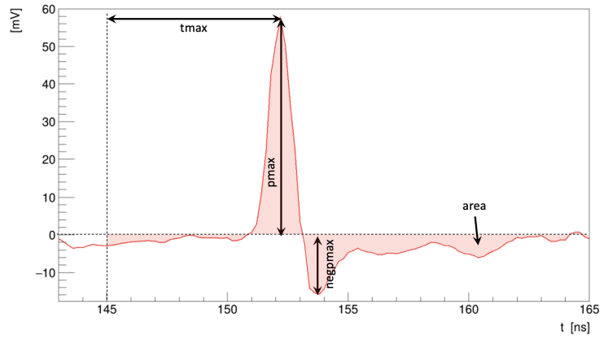
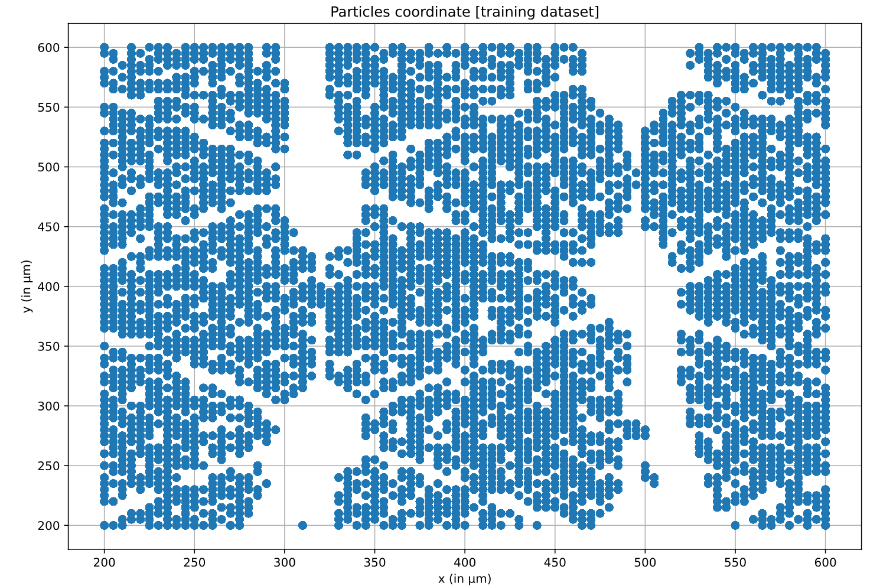
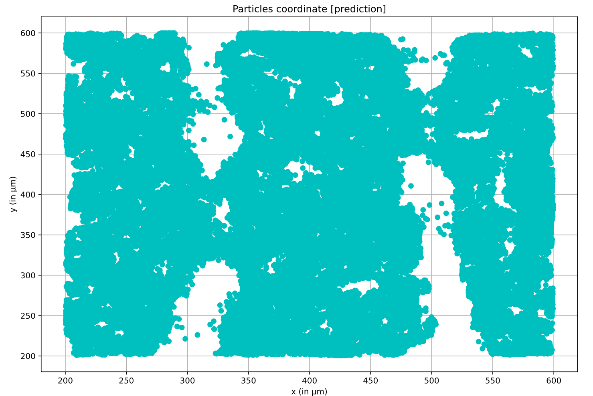

# Data science lab: process and methods

This repo contains the exam project for the Data Science Lab course at 
Politecnico di Torino and some lab exercises.

The exam project consists in a regression data science pipeline 
using scikit-learn Python library to predict particle positions based 
on multiple signals measured by a Resistive Silicon Detector.

The jupyter notebook with the solution of the exam is [here](exam/solution.ipynb).

## Labs 📚

### Lab 1

- [Iris flowers dataset matplotlib](labs/lab1/iris.ipynb)
- [Citybikes dataset - find nearest station](labs/lab1/citybikes.ipynb)
- [MNIST dataset and euclidean distance](labs/lab1/mnist.ipynb)

### Lab 2

- [Temperatures dataset fix missing values](labs/lab2/temperatures.ipynb)
- [IMDB (movie database) tf-idf](labs/lab2/movie_db_tf-idf.ipynb)

tf-idf = term frequency–inverse document frequency.

Compute the inverse document frequency (IDF). While the TF gives an idea of the weight of a token within a document, the IDF is used to find its significance among the entire collection of documents

Compute the TF-IDF. Combine the definitions of term frequency (TF) and inverse document frequency (IDF), to produce a composite weight for each term in each document. The TF-IDF weighting scheme assigns to a term t a weight in the document.

### Lab 3

- [Online retail with Apriori and FP-growth algorithms](labs/lab3/online_retail_apriori_fpgrowth.ipynb)

Using `pandas` and `from mlxtend.frequent_patterns import fpgrowth`

### Lab 4

- [K-Nearest Neighbors algorithm on Iris dataset](labs/lab4/k-neareset-neighbors.ipynb)

Build your own version of the K-Nearest Neighbors algorithm (a.k.a. KNN) using the NumPy library.

### Lab 5

- [New York points of intrest with pandas and matplotlib](labs/lab5/new_york_map_pandas_and_matplotlib.ipynb)

### Lab 6

- [Wine classification](labs/lab6/wine_classification.ipynb)

### Lab 8

- [Univariate and multivariate regression](labs/lab8/univariate_and_multivariate_regression.ipynb)
- [Series forecasting](labs/lab8/series_forecasting.ipynb)

### Lab 9

With submission
MSE score: 30917.152

- [Airbnb price prediction in New York](labs/lab9/airbnb_apartment_price_prediction.ipynb)

# Exam 🙀⏳

Autogenerated text from the LaTeX source code.

All the LaTeX source code is available in the `exam` folder with the source 
code of the project and the exam [assignment](exam/Assignment_Winter_2024.pdf).

The jupyter notebook with the solution is [here](exam/solution.ipynb).

## Problem overview

In the particle physics field, the detection of the position of a
particle is something physicists face continuously. This can be done
with various types of sensors. In this specific case a *RSD (Resistive
Silicon Detector)* was used. This type of sensor has a 2-dimensional
surface within which it can detect the passage of particles. The RSD
sensor has 12 "snowflake" shaped metallic pads that are used to measure
*signals*. When a particle traverses the sensor, signals are generated
by these pads, forming the basis for predicting the particle's (x, y)
coordinates.

For every signal measured by the pads we can extract some features:

-   *pmax* (positive peak magnitude): the magnitude of the positive peak
    of the signal, measured in millivolts (mV). This represents the
    maximum amplitude of the positive part of the signal.

-   *negpmax* (negative peak magnitude): the magnitude of the negative
    peak of the signal, measured in millivolts (mV). This represents the
    maximum amplitude of the negative part of the signal.

-   *tmax* (delay of positive peak): the delay, measured in nanoseconds
    (ns), from a reference time to when the positive peak of the signal
    occurs. This indicates the time at which the peak of the positive
    signal is reached.

-   *area* (area under the signal): the area under the signal curve.
    This provides information about the total charge or energy deposited
    by the particle as it passes through the detector.

-   *rms* (root mean square): the rms value of the signal.

Figure 1 shows a representation of a signal
measured by a pad with all the features that can be extracted from it.

The sensor output contains 18 readings of the event. Since only 12 pads
are available, some of the readings are noise and does not contain
actual readings.

The dataset contains 514,000 events, each providing 18 readings from the
12 pads. For each event the passage of a particle has been enforced so
the (x, y) coordinates are known and available in the dataset.

This multi-output regression problem involves predicting the (x, y)
coordinates of particles as they pass through a Resistive Silicon
Detector (RSD), using the provided (x, y) coordinates and the pads
readings as the evaluation set. The task requires analyzing the dataset
and developing a data science pipeline to forecast particle coordinates
from sensor readings, utilizing insights gained from the training
dataset.
The dataset is composed by two files:

-   *development.csv*: a comma-separated values file containing the
    385,500 events for the development set.

-   *evaluation.csv*: a comma-separated values file containing the
    128,500 events corresponding to the evaluation set. This portion
    does not contain the (x, y) coordinates.

For the evaluation a third csv file need to be created, This file will
contain 128,500 (x, y) predictions of the evaluation dataset. This file
will be uploaded for the final exam score.

## Proposed approach

The initial phase of our approach involves an exploration of the
dataset. This exploratory analysis aims to unveil patterns within the
sensor readings. Following dataset exploration, an analysis is conducted
to discern the importance of each extracted feature of each pad.

To enhance the model's precision, pads that introduce noise need to be
removed from the dataset. This ensures that the regression model is
trained exclusively on usefull information, tuning the dataset for
optimal performance.

### Preprocessing

A first look at the dataset reveals that it is composed of 92 columns.
It contains 5 features for every of all the 18 pads. Plus two columns
for the *x* and the *y* coordinates. A preliminary exploration into the
*x* and *y* columns discloses values within the 200 to 600 range, all of
which are multiples of 5. Consequently, *x* and *y* columns contain 81
distinct values.

In Figure 2, each event of the evaluation dataset
is collocated on a Cartesian plane using the *x* and *y* coordinates.
Looking at the image it is possible to see that there are five distinct
areas, or "holes", where there is an absence of data. This pattern
evokes the sensor image described in the problem statement, suggesting
that these "holes" might correspond to areas where the pads are
incapable of detecting data.

The preprocessing phase begins by understanding the utility of all the 5
features extracted from the signals that are exported by the pads.

Feature selection process was employed during the preprocessing phase.
After experimenting with various feature combinations, it was determined
that the model yielded better results when trained on a subset of
features. Features associated with *"tmax"* and *"rms"* were identified
as less impactful, prompting their removal from the dataset. This first
phase removes 36 columns from the dataset.
To mitigate the noise generated from 18 readings across 12 pads,
different feature selection methods have been implemented and tried with
the objective of excluding columns that contain features that are noise:

-   *VarianceThreshold*: a feature selection method that removes
    features with low variance, considering them less informative. It
    was used with *thresholds* equal to 0.35.

-   *SelectKBest*: a feature selection approach that selects the top k
    features based on a scoring function. It was used with *k* equals
    to 60. This method focuses on retaining the k most informative
    features.

-   *SelectFwe*: (Select Family-Wise Error rate): a feature selection
    method that controls the family-wise error rate to reduce the
    likelihood of false discoveries. It was used with the *scoring
    function* equivalent to *f_regression*, which assesses the linear
    relationship between each feature and the target variable.

After experimenting these feature selections methods with different
parameters the *SelectFwe* method was chosen. This feature selection
method led to the removal of another 9 columns.
After removing all the useless and/or noise features all the remaining
columns have been transformed in the range 0 to 1, meaning that the
minimum and maximum value of a feature is going to be 0 and 1. For doing
that the *MinMaxScaler* preprocessing function has been applied to the
dataset.

### Model selection

In this context of regression analysis, where the objective is to
predict continuous numerical values a regressor model needs to be used.
After performing different tests, the selected model is the *Extra Trees
Regressor* from scikit-learn's python library, but we also used the
*Random Forest Regressor* for performing tests initials on different
hyperparameters.

The *RandomForestRegressor* is an algorithm belonging to the family of
decision tree methods. Comprising an ensemble of numerous decision
trees, this model excels in capturing complex relationships within
datasets, making it particularly well-suited for regression tasks. Each
decision tree in the ensemble independently learns patterns from the
data, and the final prediction is an average or a weighted sum of
predictions from individual trees.
The ensemble nature of the model provides inherent regularization, reducing
the risk of overfitting and enhancing generalization to new data.

The *ExtraTreesRegressor* is an algorithm that creates multiple trees
and employs random subsets of features for node splitting. However, it
differs in two key aspects: it does not bootstrap observations (sampling
without replacement), and nodes are split based on random splits among a
random subset of features at each node. This distinctive approach
contributes to its effectiveness in capturing patterns within the
dataset.
After investing considerable time in fine-tuning the
*RandomForestRegressor*, we realized that the *ExtraTreesRegressor*
proved to be a better fit in this particular case. The extensive effort
in searching for optimal hyperparameters for the initial model moved to
the *ExtraTreesRegressor*, where we found that the same parameters were
well-suited for achieving improved performance.

### Hyperparameters tuning

Fine-tuning the hyperparameters of the predictive model is a crucial
step towards achieving optimal performance. In this phase, we
systematically explore different combinations of hyperparameters to
identify the configuration that yields the best results. Grid Search is
employed to methodically search through a predefined grid of
hyperparameter values. This exhaustive search allow to evaluate the
model's performance across various parameter combinations.
The pipeline has been evaluated splitting the development dataset.
Initially, a partition of 75% for training and 25% for testing resulted
in 366,225 training events and 19,275 testing events. Subsequently, in
preparation for the final submission, a more focused 95-5% split was
adopted to augment algorithm training. The decision to reduce the test
set to 5% occurred post-hyperparameter tuning, enabling the algorithm to
benefit from an increased volume of training data. This strategic
adjustment contributes to the robustness and efficacy of the trained
model.

|   time   | preprocessing |   criterion   | max_features | score |
|:--------:|:-------------:|:-------------:|:------------:|:-----:|
|  1m 03s  |      none     | squared_error  |     log2     | 5.181 |
|  1m 10s  |      none     | squared_error  |     sqrt     | 4.703 |
|  1m 32s  |      none     |  friedman_mse  |     sqrt     | 4.700 |
|  1m 49s  |      none     |    poisson     |     sqrt     | 4.695 |
|  6m 02s  |      none     | squared_error  |     0.45     | 4.251 |
|  8m 16s  |      none     | squared_error  |     0.60     | 4.286 |
|  4m 50s  |    variance   | squared_error  |     0.45     | 4.222 |
|  3m 37s  |   SelectFwe   | squared_error  |     0.45     | 4.171 |
|  2m 16s  | SelectFwe+FS  | squared_error  |     0.45     | 4.154 |

Table 1 provides an overview of the time
invested on fitting, preprocessing techniques applied, criterion
selection, maximum features considered, and the local resulting scores
achieved during the hyperparameter tuning process. It serves as a
valuable reference to understand the evolution of our model's
configuration and its corresponding impact on performance.

The *RandomForestRegressor* was tested with various key hyperparameters.
Additionally, the *Number of Estimators*, which indicates the number of
decision trees in the ensemble, was a parameter of significant
consideration. The *Number of Estimators* influence both execution time
and model precision, prompting a meticulous examination. For our
preliminary tests, we consistently set this parameter to 100 (the
default value). However, for the final submission, we conducted tests
with up to 400. This adjustment led to an increase in the model's fit
time. However, an observation was the reduction in the *Euclidean
distance* score, a positive outcome achieved without having overfitting
problems.

## Results

For the evaluation of the data science pipeline, we rely on two
evaluation metrics:

-   *R-squared* score *(R²)*: serves as a pivotal measure to gauge the
    proportion of variance in the target variable that our model
    explains. A *R²* score near to 1 means a stronger correlation
    between predicted and actual values, indicative of improved
    predictive accuracy.

-   *Euclidean distance* score: quantifies the spatial disparity between
    predicted and actual particle positions, providing a more granular
    assessment of the model's precision.
    This score will be used for the project evaluation.

During the hyperparameter tuning phase, interpreting the *R-squared*
score was challenging as it consistently hovered around 0.99, reflecting
a high level of correlation between predicted and actual values.
Consequently, our focus shifted to the *Euclidean distance* score, which
provided a more readable assessment.

In the initial tests, the *R²* score registered 0.99848024, while the
*Euclidean distance* stood at 5.181. Following hyperparameter tuning,
these metrics further improved, reaching an *R²* score of 0.99903096 and
a reduced *Euclidean distance* of 4.251.

Subsequently, preprocessing techniques were applied to get better
results:

-   Using *VarianceThreshold* the *Euclidean distance* further decreased
    to 4.222.

-   Using *SelectFwe*: approach resulted in a *Euclidean distance* of
    4.171.

-   *SelectFwe* + Feature Selection removing redundant features such as
    *"tmax"* and *"rms"* resulted to an *Euclidean distance* of 4.154.

These adjustments and preprocessing steps not only fine-tuned our model
but also spotlighted the significance of carefully chosen evaluation
metrics, ensuring a comprehensive understanding of the pipeline
capabilities.
As explained in the hyperparameters section, all these tests were
conducted with the *Number of Estimators* set to 100. In preparation for
submission, the algorithm was refitted with 400 estimators, resulting in
a *Euclidean distance* of 3.907, obtained after 5 minutes of fitting.
However, the score obtained with the submitted CSV file was 4.479. We
have noticed a consistent pattern where the submission platform tends to
yield a score approximately 0.6 higher than the local score.

In Figure 3, each event predicted by the
pipeline is collocated on a Cartesian plane using the predicted feature
*x* and *y*. This is a representation of the evaluation.csv submitted to
the scoring platform.

## Discussion

In this project paper, we have presented a viable solution for
predicting the position of a particle based on a set of extracted
features from signals obtained through the RSD sensor measurements.

In our exploration, we initially directed our attention to the
*RandomForestRegressor*, experimenting with various hyperparameters to
fine-tune its performance. While these attempts yielded valuable
insights, the pursuit of further improvements led us to test the
*RandomForestClassifier*. With this classifier the local *Euclidean
distance* score failed to reach the desired levels, peaking at 7.

Figure 4 provides a visual
representation of the predicted *x* and *y* positions where the
coordinates of all the predicted signals are grouped in different
clusters.
We finally chose the *ExtraTreesRegressor*, utilizing the same
hyperparameters as the *RandomForestRegressor*. Remarkably, this
adjustment resulted in a significantly improved *Euclidean distance*
score, lowering to 3.907, with a fitting time of near 5 minutes. This
effort produced a final score of **4.479**.
Examining the leaderboard, it becomes apparent that superior results
have been achieved, placing our solution in the top 22%. While
acknowledging that better solutions are available, we think that our
achieved score is considered quite good.

Given that the sensor's *x* and *y* measurements are multiples of 5, and
our score is lower than 5, the margin of error falls within an
acceptable range.
